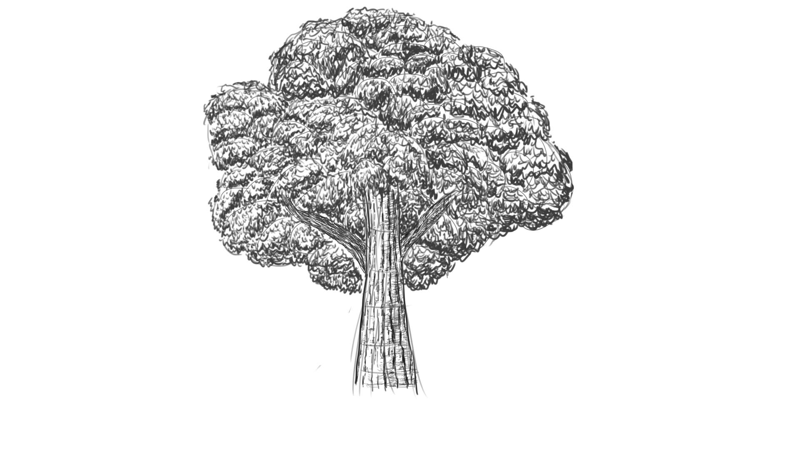
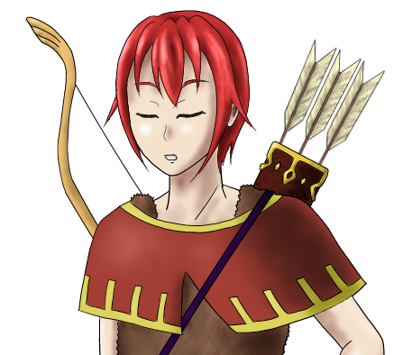

現在可以公開的情報
==
背景
--
環境參考：[さて、異世界を攻略しようか](http://search.books.com.tw/search/query/key/%E3%81%95%E3%81%A6%E3%80%81%E7%95%B0%E4%B8%96%E7%95%8C%E3%82%92%E6%94%BB%E7%95%A5%E3%81%97%E3%82%88%E3%81%86%E3%81%8B/cat/all) -- おかざき登 (已完結，共 7 卷)

1. 這是一個由 Mission 推動封閉的世界。
2. 依據行動獲得相對應的技能熟練度與技能。

角色
--

灰色的樹

在人來人往的街道旁，有一顆灰色的樹。  
以神秘的力量吸引了形形色色的人們。  
部位：  
* 樹幹：具有某種力量，能夠吸引各 Mission 。  
* 樹冠：長滿了灰色的樹葉與枝條，似乎能夠當作媒介。  

里昂 (Lion)  

代表色：紅色  
獵人擔當。  
似乎是 組織 的人員  
技能：  
 * 看破 (LV 5)
 * 修正 (LV ??)
